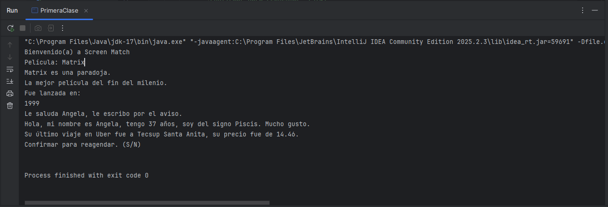
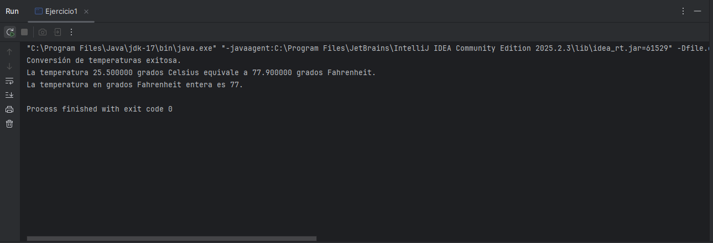
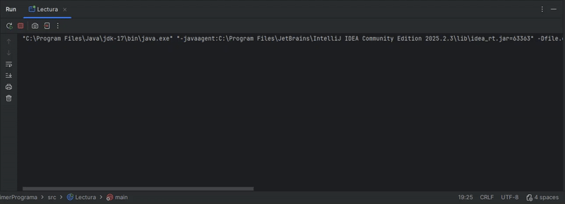
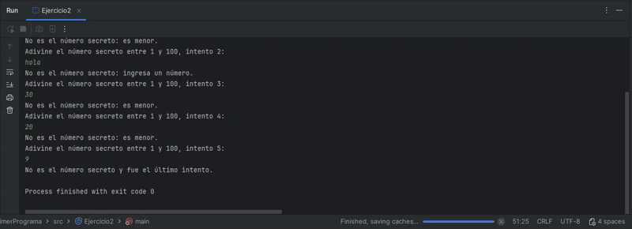

# ONE: PrimerPrograma

 


## Introducción

El programa [Oracle Next Education (ONE)](https://www.oracle.com/latam/education/oracle-next-education/) es un programa de educación, inclusión y empleabilidad que forma a personas en tecnología y las conecta con el mercado laboral con el apoyo de empresas asociadas.

Es un programa gratuito que dura 12 meses. Abre inscripciones 2 veces al año donde las personas pueden postular mediante un formulario. Cada generación es enumerada con números arábigos.

El proyecto PrimerPrograma es uno de los proyectos en Java del programa ONE de Oracle y Alura Latam del grupo G9 que inició en julio 2025. Es el proyecto donde se desarrollan los ejercicios del primer curso *Java: creando tu primera aplicación* de la primera formación *Java Orientado a Objetos G9 - ONE* de la especialización de Back-end.

En esta primera fase de la 3era etapa del programa ONE, las clases han cubierto lo básico sobre la programación en Java: comentarios, estructuras condicionales e iterativas, operaciones aritméticos, relacionales, lógicos y auto-incrementales, uso de variables, tipos de datos, Casting, convenciones de nombres, imprimir texto en consola y obtención de datos con la clase Scanner, la clase String, bloques de texto y formato de textos.

## Descripción del proyecto

PrimerPrograma es una compilación de ejercicios para aplicar lo cubierto en el curso. La mayoría son simples y básicos, pero te invito a revisar la clase Ejercicio2 donde está el *Desafío: juego de adivinación*.

## Estado del proyecto

El proyecto aún se encuentra en desarrollo, quedando pendiente la finalización de la última clase del curso para alcanzar la versión 1.0.

El proyecto se encuentra en su [versión 0.4.3](#registro-de-cambios).

## Demostración de funcionalidad

La clase PrimeraClase contiene ejercicios de asignación de variables, bloques de texto, impresión en pantalla (consola), formato de textos.



La clase Ejercicio1 contiene el ejercicio del Conversor de temperaturas.

El valor a convertir se encuentra ya ingresado en una variable, el programa aplica una fórmula para convertir de grados Celsius a Fahrenheit, muestra en pantalla el resultado, convierte a entero el resultado y lo muestra en patanlla también.



La clase Lectura contiene un ejercicio para practicar el uso de la clase Scanner para el ingreso de datos mediante el teclado.

Se solicita al usuario el ingreso de 3 datos que se almacenan en variables, se imprimen en pantalla y se cierra el objeto de la clase Scanner.



La clase Ejercicio2 contiene el desarrollo del *Desafío: juego de adivinación* donde se aplican todo los temas estudiados en el curso.

El usuario tiene 5 intentos para adivinar un número secreto generado al azar por el programa entre 1 y 100, tras cada intento fallido el programa da pistas si el número secreto es mayor o menor que el ingresado. El programa realiza 2 validaciones adicionales: que el valor ingresado sea un número entero y, que el número ingresado se encuentre entre 1 y 100.



## Instalación local

1. Clona el código fuente del repositorio.

```
git clone https://github.com/PolloRosa/ONE-PrimerPrograma.git
```

2. Abrir el proyecto con el IDE IntelliJ IDEA.

3. Ejecutar la clase de su elección, ya que todas tienen método main.

## Tecnologías utilizadas

* JDK 17.0.13
* IntelliJ IDEA Community Edition 2025.2.3
* Git para control de versiones

## Registro de cambios

0.4.3 *20 octubre 2025*

* :sparkles: Agrega el cierre del scanner al final en la clase Ejercicio2.

0.4.2 *20 octubre 2025*

* :no_entry_sign: Borra el continue del bloque catch en la clase Ejercicio2.

0.4.1 *20 octubre 2025*

* :pencil2: Corrige constante de número máximo en la clase Ejercicio2.
* :sparkles: Agrega constantes para los mensajes de éxito, error y fracaso en la clase Ejercicio2.

0.4.0 *20 octubre 2025*

* :white_check_mark: Agrega desafío de Juego de adivinación en la clase Ejercicio2.

0.3.0 *19 octubre 2025*

* :white_check_mark: Agrega ejercicio para el ingreso de datos usando la clase Scanner en la clase Lectura.

0.2.1 *19 octubre 2025*

* :pencil2: Corrige código en la clase Ejercicio1.

0.2.0 *19 octubre 2025*

* :white_check_mark: Agrega desafío de Conversión de temperaturas en la clase Ejercicio1.

0.1.1 *19 octubre 2025*

* :white_check_mark: Agrega ejercicio de formateo de textos en la clase PrimeraClase.

0.1.0 *17 octubre 2025*

* :white_check_mark: Agrega ejercicios en la clase PrimeraClase:
* Ejercicio sobre asignación en variables.
* Ejercicio sobre operadores auto-incrementales.
* Ejercicio sobre convenciones de código en Java.
* Ejercicio sobre uso de variables de tipo String.

## Autor

Angela Cáceres @PolloRosa :baby_chick:

## Licencia

El proyecto está bajo la licencia MIT. Puedes usarlo, compartirlo y modificarlo libremente, incluso con fines comerciales. La única condición es que conserves el aviso de derechos de autor original y el texto de la licencia en todas las copias o partes sustanciales del software. 